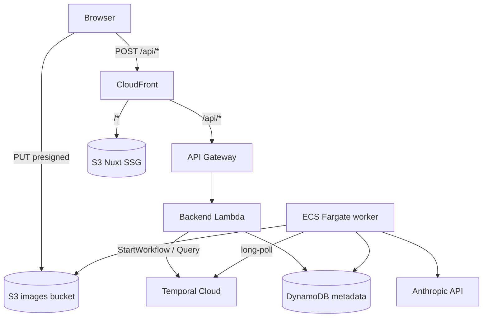

# AWS Image Processing Demo

A conference and customer demo showcasing
**Temporal Cloud + AWS** through an image-processing
burst pipeline. Built to make durable orchestration,
fan-out/fan-in, and AI integration tangible for AWS
architects and developers.

[](LICENSE)

## Features

- **Bursty image pipeline** — upload N images, watch
  Temporal fan them out into 8 activities per image
  (resize × 3, describe, watermark × 3, persist).
- **Durable execution** — kill the worker mid-burst;
  Temporal Cloud keeps the workflows alive and a new
  Fargate task resumes where the previous one left off.
- **AI in the loop** — each image is described and
  labeled by Claude Haiku 4.5 vision.
- **Direct-to-S3 uploads** — the backend signs PUT
  URLs; bytes never touch the API.
- **Shareable pipelines** — every burst gets a pipeline
  ID, threaded through the URL, workflow IDs, S3
  prefixes, and DynamoDB items.
- **Single-domain deploy** — CloudFront fronts both
  the Nuxt SSG frontend and the API Gateway backend
  under one custom domain managed via Cloudflare DNS.

## Prerequisites

- **Go** 1.26 or newer
- **Node.js** 24 LTS (or newer) and **pnpm** 9 (or newer)
- **Docker** and **Docker Compose**
- **OpenTofu** 1.8 or newer (for AWS deployment)
- **AWS CLI v2** (for AWS deployment)
- **Temporal CLI** — `brew install temporal`
- An **Anthropic API key** — used in both local dev
  and production (Moto Server does not mock Bedrock)

For AWS deployment you also need an AWS account in
`eu-west-3`, plus a Cloudflare account and API token
if you want a custom domain.

## Getting Started

```bash
git clone https://github.com/alexandreroman/aws-image-processing-demo.git
cd aws-image-processing-demo

# Configure secrets
cp .env.example .env
# edit .env and set ANTHROPIC_API_KEY (the only var dev needs from .env)

cp .env.local.example .env.local
# .env.local overrides .env with Moto + local Temporal settings

# Local dev — Temporal dev server and Moto Server
# (S3 + DynamoDB) in Docker; worker, backend, and
# frontend as host processes with hot reload.
# Frontend deps install automatically on first run.
make dev
```

For a fully containerized stack (everything in Docker,
no host processes), use `make app-up` instead.

Once the stack is up:

- Frontend — <http://localhost:3000>
- Backend API — <http://localhost:8000/api>
- Temporal UI — <http://localhost:8233>
- Moto Server endpoint — <http://localhost:4566>

Open the frontend, pick a number of images, and click
**Start burst**. You will be redirected to
`/pipelines/{pipelineId}` where the gallery fills in as
workflows complete.

## Usage

### Run a single workflow from the CLI

Useful for debugging activities without going through
the frontend. Use the `temporal` CLI directly.

```bash
temporal workflow start \
  --type ProcessImage \
  --task-queue image-processing \
  --workflow-id "manual-$(uuidgen)" \
  --input '{"bucket":"aws-image-processing-demo-images-local","key":"samples/dog.jpg"}'
```

The image must already be present in the bucket
(upload it manually with `aws --endpoint-url
http://localhost:4566 s3 cp ...` first).

### Run unit tests

```bash
make test
```

### Deploy to AWS

The worker container image is built and pushed to
GHCR by a GitHub Actions workflow on every push to
`main`. Then, from a clone:

```bash
# Configure secrets for deployment
cp .env.example .env
# edit .env — set TEMPORAL_*, ANTHROPIC_API_KEY, paths to Temporal Cloud certs.
# AWS auth comes from your CLI profile (`aws sts get-caller-identity`).

make deploy
# runs: scripts/deploy.sh
#       (build-lambda, tofu init+apply, frontend build+sync, CF invalidation)
```

To re-deploy only the frontend (typical iteration):

```bash
make frontend-deploy
```

To tear everything down:

```bash
make teardown
```

## Configuration

All configuration is via environment variables, loaded
through two layers of files: `.env` is the canonical,
deploy-shaped configuration (Temporal Cloud, Anthropic,
AWS region). `.env.local` is an opt-in overlay that
local-dev Make targets (`make dev`, `make backend`,
`make worker`, `make frontend`, `make app-up`,
`make infra-up`, `make test`, `make check`) layer on top
to point at Moto + a Temporal dev server. Deploy targets
(`make deploy`, `make frontend-deploy`, `make teardown`)
load only `.env`. Both files are gitignored — copy from
`.env.example` / `.env.local.example`.

| Variable                | Description                                   | Default                  |
| ----------------------- | --------------------------------------------- | ------------------------ |
| `TEMPORAL_ADDRESS`      | Temporal frontend address                     | `localhost:7233`         |
| `TEMPORAL_NAMESPACE`    | Temporal namespace                            | `default`                |
| `TEMPORAL_TLS_CERT`     | Path to client cert (Temporal Cloud only)     | (empty)                  |
| `TEMPORAL_TLS_KEY`      | Path to client key (Temporal Cloud only)      | (empty)                  |
| `TEMPORAL_TASK_QUEUE`   | Worker task queue                             | `image-processing`       |
| `AWS_ENDPOINT_URL`      | Override AWS endpoint (set for Moto Server)   | `http://localhost:4566`  |
| `AWS_REGION`            | AWS region                                    | `eu-west-3`              |
| `IMAGES_BUCKET`         | S3 bucket holding uploads and derivatives     | (Tofu-injected in AWS)   |
| `IMAGES_TABLE`          | DynamoDB table holding image manifests        | (Tofu-injected in AWS)   |
| `ALLOWED_ORIGIN`        | CORS allow-origin for the backend             | `*` (dev), set in prod   |
| `ANTHROPIC_API_KEY`     | Anthropic API key (used in dev and prod)      | (required)               |
| `CLOUDFLARE_API_TOKEN`  | Cloudflare DNS token (only for `tofu apply`)  | (empty)                  |
| `CLOUDFLARE_ZONE_ID`    | Cloudflare zone ID                            | (empty)                  |

## Architecture



A burst is orchestrated by a parent `LaunchPipelines`
workflow that fans out one child `ProcessImage` workflow
per image. Each `ProcessImage` runs 8 activities,
6 of which execute in parallel:

1. Fan-out 3 × `ResizeAndUpload` (small / medium / large)
2. 1 × `GenerateDescription` on the medium size
3. Fan-out 3 × `ApplyWatermark`
4. 1 × `StoreManifest` to DynamoDB

The workflow ID format is
`pipeline-<pipelineId>-<imageId>` (where `<pipelineId>` and
`<imageId>` are short 8-char hex IDs) so the Temporal UI
can filter a whole burst with a `pipeline-<pipelineId>`
prefix search.

### Modules

| Module                     | Description                                              |
| -------------------------- | -------------------------------------------------------- |
| `cmd/worker`               | Temporal worker for ECS Fargate                          |
| `cmd/backend`              | Backend service — Lambda or local HTTP server            |
| `internal/workflows`       | `LaunchPipelines` and `ProcessImage` workflows           |
| `internal/activities`      | Resize, describe, watermark, store activities            |
| `internal/manifest`        | Shared manifest types and canonical size list            |
| `internal/awsclient`       | AWS SDK config (Moto-aware)                              |
| `internal/anthropicclient` | Anthropic API wrapper                                    |
| `internal/temporalclient`  | Temporal SDK client (mTLS-aware for Temporal Cloud)      |
| `internal/api`             | HTTP handlers under `/api/*` (presign, workflows, …)     |
| `frontend`                 | Nuxt 4 SSG frontend (Tailwind, pnpm)                     |
| `infra`                    | OpenTofu modules for AWS + Cloudflare DNS                |
| `scripts`                  | Deploy, teardown, and sample-upload helpers              |

## Contributing

Issues and pull requests are welcome.

## License

This project is licensed under the Apache-2.0 License
— see [LICENSE](LICENSE) for details.
