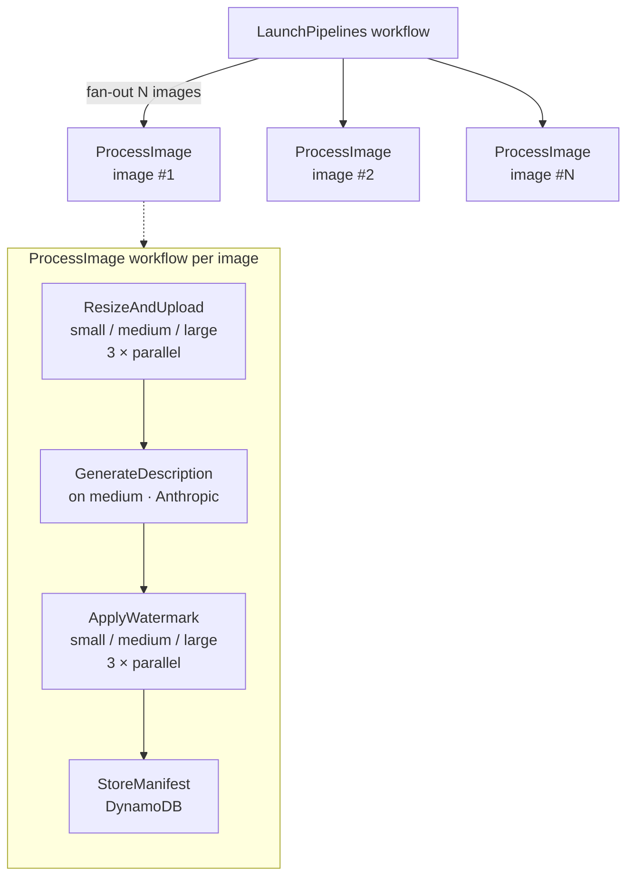
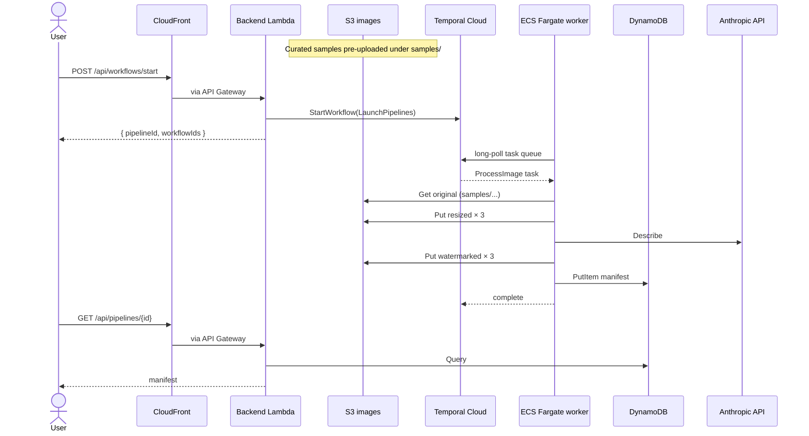
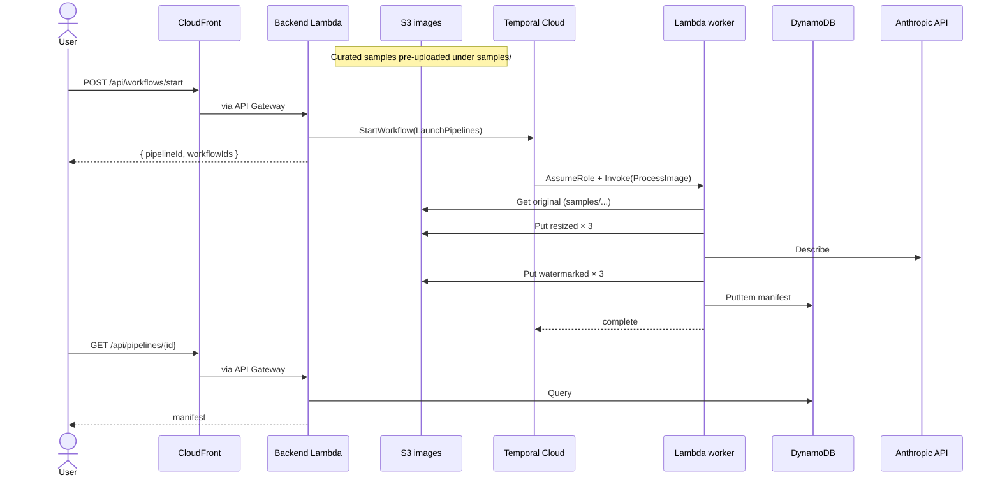
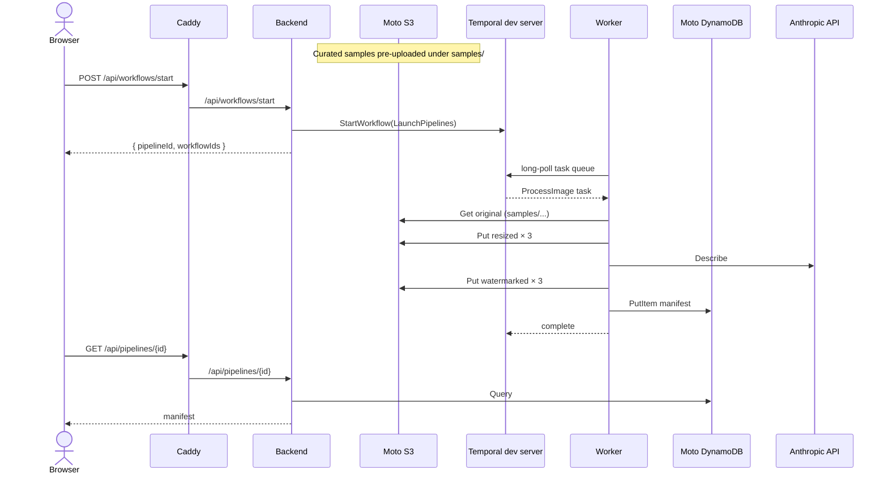

# AWS Image Processing Demo

A conference and customer demo showcasing
**Temporal Cloud + AWS** through an image-processing
burst pipeline. Built to make durable orchestration,
fan-out/fan-in, and AI integration tangible for AWS
architects and developers.

[](https://github.com/alexandreroman/aws-image-processing-demo/actions/workflows/ci.yml)
[](LICENSE)

## Features

- **Bursty image pipeline** — pick N images from the
  curated sample set, watch Temporal fan them out into
  8 activities per image (resize × 3, describe,
  watermark × 3, persist).
- **Durable execution** — kill the worker mid-burst;
  Temporal Cloud keeps the workflows alive and a new
  Fargate task resumes where the previous one left off.
- **AI in the loop** — each image is described and
  labeled by Claude Haiku 4.5 vision.
- **Curated sample library** — a fixed set of images
  is pre-uploaded under `samples/` in the bucket; the
  UI picks from that set, so no user upload path is
  exposed.
- **Shareable pipelines** — every burst gets a pipeline
  ID, threaded through the URL, workflow IDs, S3
  prefixes, and DynamoDB items.
- **Single-domain deploy** — CloudFront fronts both
  the Nuxt SSG frontend and the API Gateway backend
  under one custom domain managed via Cloudflare DNS.

## Prerequisites

- **Go** 1.26 or newer
- **Node.js** 24 LTS (or newer) and **pnpm** 9 (or newer)
- **Docker** and **Docker Compose**
- **OpenTofu** 1.8 or newer (for AWS deployment)
- **AWS CLI v2** (for AWS deployment)
- **Temporal CLI** — `brew install temporal`
- An **Anthropic API key** — used in both local dev
  and production ([Moto Server](https://github.com/getmoto/moto)
  does not mock Bedrock)

For AWS deployment you also need an AWS account
(defaults to `eu-west-1`, override via `AWS_REGION`),
plus a Cloudflare account and API token if you want
a custom domain.

## Getting Started

```bash
git clone https://github.com/alexandreroman/aws-image-processing-demo.git
cd aws-image-processing-demo

# Configure secrets
cp .env.example .env
# edit .env and set ANTHROPIC_API_KEY (the only var dev needs from .env)

cp .env.local.example .env.local
# .env.local overrides .env with Moto + local Temporal settings

# Local dev — Temporal dev server and Moto Server
# (S3 + DynamoDB) in Docker; worker, backend, and
# frontend as host processes with hot reload.
# Frontend deps install automatically on first run.
make dev
```

For a fully containerized stack (everything in Docker,
no host processes), use `make app-up` instead. The
compose stack runs a Caddy-fronted frontend container
that serves the prebuilt Nuxt SSG bundle on `:3000`,
reverse-proxies `/api/*` to the backend, and reverse-
proxies `/images/*` to Moto (S3 images bucket) —
single-origin, mirroring the prod CloudFront topology.
The stack is self-contained: it uses a local Temporal
dev server and Moto, independent of the Cloud creds in
`.env`. Only `ANTHROPIC_API_KEY` is sourced from `.env`
(compose-time interpolation).

Once the stack is up:

- Frontend — <http://localhost:3000> serves the UI and
  proxies `/api/*` + `/images/*` internally (Nuxt
  devProxy in `make dev`, Caddy in `make app-up`).
- Backend API — <http://localhost:8000/api> stays
  published in both modes for direct probing.
- Temporal UI — <http://localhost:8233>
- Moto Server endpoint — <http://localhost:4566>

Open the frontend, pick a number of images, and click
**Start burst**. You will be redirected to
`/pipelines/{pipelineId}` where the gallery fills in as
workflows complete.

## Usage

### Run a single workflow from the CLI

Useful for debugging activities without going through
the frontend. Use the `temporal` CLI directly.

```bash
temporal workflow start \
  --type ProcessImage \
  --task-queue image-processing \
  --workflow-id "manual-$(uuidgen)" \
  --input '{
    "pipelineId": "manual",
    "imageId": "dog",
    "original": {
      "bucket": "aws-image-processing-demo-images-local",
      "key": "samples/dog.jpg"
    }
  }'
```

The image must already be present in the bucket
(upload it manually with `aws --endpoint-url
http://localhost:4566 s3 cp ...` first).

### Run unit tests

```bash
make test
```

### Deploy to AWS

The worker container image is built and pushed to
GHCR by a GitHub Actions workflow on every push to
`main`. Then, from a clone:

```bash
# Configure secrets for deployment
cp .env.example .env
# edit .env — set TEMPORAL_*, ANTHROPIC_API_KEY, paths to Temporal Cloud certs.
# AWS auth comes from your CLI profile.

make deploy
# runs: scripts/deploy.sh
#       (build-lambda, tofu init+apply, frontend build+sync, CF invalidation)
```

To re-deploy only the frontend (typical iteration):

```bash
make frontend-deploy
```

To tear everything down:

```bash
make teardown
```

## Configuration

All configuration is via environment variables, loaded
through two layers of files: `.env` is the canonical,
deploy-shaped configuration (Temporal Cloud, Anthropic,
AWS region). `.env.local` is an opt-in overlay that
local-dev Make targets (`make dev`, `make backend`,
`make worker`, `make frontend`, `make app-up`,
`make infra-up`, `make test`, `make check`) layer on top
to point at Moto + a Temporal dev server. Deploy targets
(`make deploy`, `make frontend-deploy`, `make teardown`)
load only `.env`. Both files are gitignored — copy from
`.env.example` / `.env.local.example`.

**Canonical (`.env`)** — required for `make deploy`:

| Variable                | Description                                          | Default              |
| ----------------------- | ---------------------------------------------------- | -------------------- |
| `TEMPORAL_ADDRESS`      | Temporal Cloud gRPC endpoint                         | (required)           |
| `TEMPORAL_NAMESPACE`    | Temporal Cloud namespace                             | (required)           |
| `TEMPORAL_TLS_CERT`     | Path to mTLS client cert (PEM)                       | (required for Cloud) |
| `TEMPORAL_TLS_KEY`      | Path to mTLS client key (PEM)                        | (required for Cloud) |
| `TEMPORAL_CLOUD_EXTERNAL_ID`    | External ID Temporal Cloud presents when assuming the invoker role (see note below) | `aws-image-processing-demo` |
| `ANTHROPIC_API_KEY`     | Anthropic API key                                    | (required)           |
| `TEMPORAL_METRICS_API_KEY` | Temporal Cloud service-account API key with the Metrics Read-Only role. Enables ECS Fargate worker autoscaling only — Lambda scales natively and is unaffected. | (empty = ECS autoscaling disabled) |
| `AWS_REGION`            | AWS region for the deployment                        | `eu-west-1`          |
| `DOMAIN_NAME`           | Custom-domain root (e.g. `example.com`); empty = use the default `*.cloudfront.net` hostname | (empty) |
| `SUBDOMAIN`             | Subdomain when `DOMAIN_NAME` is set                  | `demo`               |
| `CLOUDFLARE_API_TOKEN`  | Cloudflare DNS token; required only when `DOMAIN_NAME` is set | (empty)     |
| `CLOUDFLARE_ZONE_ID`    | Cloudflare zone ID for the demo domain               | (empty)              |
| `WORKER_IMAGE`          | Override the Fargate worker image                    | (GHCR `:latest`)     |
| `WORKER_MAX_CONCURRENT_ACTIVITIES` | Max activities a worker executes concurrently. Lower values trigger autoscaling earlier. | `4` |

> **Note — `TEMPORAL_CLOUD_EXTERNAL_ID`.** This is the
> `sts:ExternalId` trust-condition value Temporal Cloud
> must present when assuming the `wci-lambda-invoke`
> IAM role to invoke the Lambda worker. It acts as a
> shared secret tying your Temporal Cloud namespace to
> this AWS account — set it to a value known only to
> you and your namespace. Leaving it empty disables the
> Lambda invoker role (ECS-only deploy).

**Dev overlay (`.env.local`)** — layered on top of `.env` only by host-mode dev targets (`make dev`, `make backend`, `make worker`, `make frontend`, `make infra-up`, `make test`, `make check`):

| Variable                | Description                                          | Value                |
| ----------------------- | ---------------------------------------------------- | -------------------- |
| `AWS_ENDPOINT_URL`      | Point the AWS SDK at the local Moto Server           | `http://localhost:4566` |
| `IMAGES_BUCKET`         | Fixed bucket name used by the dev stack              | `aws-image-processing-demo-images-local` |
| `IMAGES_TABLE`          | Fixed DynamoDB table name used by the dev stack      | `aws-image-processing-demo-images-local` |
| `TEMPORAL_ADDRESS`      | Override Temporal Cloud with the local dev server    | `localhost:7233` (optional, commented by default) |
| `TEMPORAL_NAMESPACE`    | Namespace on the local dev server                    | `default` (optional) |
| `TEMPORAL_TLS_CERT`     | Disable mTLS for the local dev server                | empty (optional)     |
| `TEMPORAL_TLS_KEY`      | Disable mTLS for the local dev server                | empty (optional)     |

In `make app-up` (fully containerized), `compose.yaml` embeds the dev constants directly — `.env.local` is not consulted. Only `ANTHROPIC_API_KEY` is interpolated from `.env` at compose-time.

## Architecture

### Workflow

A burst is orchestrated by a `LaunchPipelines`
workflow that fans out one independent top-level
`ProcessImage` workflow per image (not a Temporal
child workflow — `LaunchPipelines` returns as soon as
every `ExecuteWorkflow` start is acknowledged, keeping
the synchronous backend call well within the API
Gateway 29 s timeout). Each `ProcessImage` runs
8 activities, 6 of which execute in parallel:

1. Fan-out 3 × `ResizeAndUpload` (small / medium / large)
2. 1 × `GenerateDescription` on the medium size
3. Fan-out 3 × `ApplyWatermark`
4. 1 × `StoreManifest` to DynamoDB



The workflow ID format is
`image-pipeline-<pipelineId>-<imageId>` (where `<pipelineId>`
and `<imageId>` are short 8-char hex IDs) so the Temporal UI
can filter a whole burst with an `image-pipeline-<pipelineId>-`
prefix search.

### Deployment topology

Both worker runtimes (ECS Fargate and AWS Lambda) are
deployed side by side by `make deploy`. The UI's
control panel exposes a selector, and the runtime is
picked **per burst** — see
[Deployment modes](#deployment-modes) for the
trade-offs. The two diagrams below show the same
ingress path with each runtime in turn.

**ECS Fargate runtime** — long-running worker that
long-polls Temporal Cloud.



**AWS Lambda runtime** — Temporal Cloud assumes an
IAM role and invokes the Lambda worker per task.



The same shape applies locally in `make app-up`: Caddy
plays the role of CloudFront, fronting both the static
Nuxt SSG bundle and the API. There is a single
long-running worker — no runtime selector.



### Modules

| Module                     | Description                                              |
| -------------------------- | -------------------------------------------------------- |
| `cmd/worker`               | Temporal worker (host / Docker / ECS Fargate / AWS Lambda); `/healthz` on `:8001` in long-running modes |
| `cmd/backend`              | Backend — Lambda or local HTTP server on `:8000`         |
| `internal/workflows`       | `LaunchPipelines` and `ProcessImage` workflows           |
| `internal/activities`      | Resize, describe, watermark, store activities            |
| `internal/manifest`        | Shared manifest types and canonical size list            |
| `internal/awsclient`       | AWS SDK config (Moto-aware)                              |
| `internal/anthropicclient` | Anthropic API wrapper                                    |
| `internal/temporalclient`  | Temporal SDK client (mTLS-aware for Temporal Cloud)      |
| `internal/api`             | HTTP handlers — `/api/*` plus `/healthz` at the root     |
| `frontend`                 | Nuxt 4 SSG frontend (Tailwind, pnpm)                     |
| `infra`                    | OpenTofu modules for AWS + Cloudflare DNS                |
| `scripts`                  | Deploy, teardown, and sample-upload helpers              |

## Deployment modes

The worker is a single Go binary that runs in four
execution contexts from the same source — the context
is selected by the environment, not by build flags. In
prod, `make deploy` provisions both the ECS Fargate
and the AWS Lambda worker side by side: it builds the
worker container for ECS, packages `build/worker.zip`
for Lambda, and applies both Tofu stacks in one go.

| Context         | How to run                                | Process model         | Key trade-off                                       |
| --------------- | ----------------------------------------- | --------------------- | --------------------------------------------------- |
| Host            | `make dev`                                | Long-running poll     | Fastest iteration; runs on the developer machine.   |
| Docker          | `make app-up`                             | Long-running poll     | Containerized parity with prod; single host.        |
| ECS Fargate     | `make deploy` (deployed alongside Lambda) | Long-running poll     | Warm cache, stable concurrency; pays even at idle.  |
| AWS Lambda      | `make deploy` (deployed alongside ECS)    | Per-invocation worker | Scale-to-zero, pay-per-invocation; cold-start cost. |

The first three contexts share the same long-running
code path: the worker keeps an open gRPC long-poll
against Temporal and exposes `/healthz` on `:8001` for
the container orchestrator. Lambda mode is detected at
startup via the presence of `AWS_LAMBDA_FUNCTION_NAME`
(always set by the Lambda runtime); the binary then
hands control to
`go.temporal.io/sdk/contrib/aws/lambdaworker`, which
spins up a worker per invocation and shuts it down
when the invocation ends.

Because both runtimes are always deployed, the runtime
choice moves to the API layer and is made **per
burst**. The backend exposes the available runtimes
via `GET /api/runtimes`; the UI's control panel shows
a selector, and `POST /api/workflows/start` accepts a
`runtime` field that picks the matching Temporal task
queue (`image-processing-ecs` or
`image-processing-lambda`). The starter activity
schedules each `ProcessImage` on the same task queue
it was itself scheduled on (read from
`activity.GetInfo`), so a whole burst stays on a
single runtime end-to-end.

The selector is **AWS-only**: it appears when Tofu has
set `WORKER_TASK_QUEUE_ECS` and `WORKER_TASK_QUEUE_LAMBDA`
on the deployed backend Lambda. In local dev (`make dev`,
`make app-up`) those vars are unset, so `GET /api/runtimes`
returns `[]`, the UI hides the selector, and the single
worker process polls one legacy queue (`image-processing`).

The classic trade-off still applies, just per burst
rather than per deploy. ECS Fargate keeps a hot
in-process cache of decoded workflow histories and
offers stable concurrency, at the cost of paying for
an always-on task. AWS Lambda scales to zero and
charges only when invoked, but each new container
pays a cold-start replay cost as the workflow history
is rebuilt from scratch. For dev or demo work, pick
ECS Fargate for predictable behavior; for spiky or
low-volume workloads where cost matters more than
steady-state latency, Lambda is the attractive
option.

### ECS worker autoscaling

ECS worker autoscaling is opt-in. Provide
`TEMPORAL_METRICS_API_KEY` in `.env` to enable it; leave
it unset to keep a fixed single-task worker (no ADOT
collector, no CloudWatch alarms, no scaling policies).

The ECS Fargate runtime auto-scales from 1 to 5 tasks
based on the actual Temporal task queue backlog,
following the canonical CREMA / KEDA pattern — but
with zero custom code. An ADOT (AWS Distro for
OpenTelemetry) Collector runs as its own single-task
Fargate service, scrapes Temporal Cloud's OpenMetrics
endpoint (`https://metrics.temporal.io/v1/metrics`)
every 60 s as a Bearer-authenticated Prometheus
target, drops every series that does not match our
task queue, and republishes
`temporal_cloud_v1_approximate_backlog_count` to
CloudWatch under the `TemporalDemo/Worker` namespace
via the `awsemf` exporter. Two CloudWatch alarms then
drive step-scaling policies on the ECS worker
service, each using Metric Math to sum the `workflow`
and `activity` series (since a worker pulls from
both): scale-out fires after 1 datapoint above 10
(+1/+2/+3 tasks depending on depth, 30 s cooldown);
scale-in fires after 5 datapoints below 5 (-1 task,
120 s cooldown).

The collector authenticates with a Temporal Cloud
service-account API key bearing the **Metrics
Read-Only** account role. To mint one, create a
[service account](https://docs.temporal.io/cloud/service-accounts)
with that role and issue an
[API key](https://docs.temporal.io/cloud/api-keys)
for it (see also the Temporal Cloud
[observability / OpenMetrics guide](https://docs.temporal.io/cloud/metrics/)
for the endpoint shape and the supported metric
series). Provide the key via the
`TEMPORAL_METRICS_API_KEY` env variable in `.env`;
Tofu creates the Secrets Manager secret automatically
(same pattern as `ANTHROPIC_API_KEY`). When the
variable is unset or empty, the autoscaling stack is
skipped entirely and the ECS worker stays at
`desired_count = 1`.

**Reactivity caveat.** The OpenMetrics endpoint
serves data with a fixed 3-minute aggregation lag,
plus the collector's 60 s scrape interval, plus the
CloudWatch alarm's 60 s period — total end-to-end
reaction time is ~4–5 min. A single ~48-image
pipeline (30–90 s) will not trigger autoscaling —
the warm worker handles it alone. The autoscaler is
meaningful for **sustained or repeated load**
(3+ pipelines back-to-back, or pipelines of hundreds
of images).

**Cost note.** The always-on collector task runs at
0.25 vCPU / 0.5 GB Fargate ARM64 — about **$10/month**
in `eu-west-1`. The zero-code, all-config architecture
uses the supported public Temporal Cloud OpenMetrics
surface end-to-end.

The Temporal-Cloud-assumes-AWS-role flow for the Lambda
runtime is wired by two Tofu variables:
`temporal_cloud_aws_account_ids` (defaulted to the 5
Temporal Cloud invoker cells published in their
CloudFormation template) and `temporal_cloud_external_id`.
When the external ID is set, an IAM role is created with
`lambda:InvokeFunction` + `lambda:GetFunction` and an
`sts:ExternalId` trust condition so any of the 5 Temporal
Cloud cells can assume it (via the `wci-lambda-invoke`
role) to invoke the Lambda worker.

## Contributing

Issues and pull requests are welcome.

## License

This project is licensed under the Apache-2.0 License
— see [LICENSE](LICENSE) for details.
